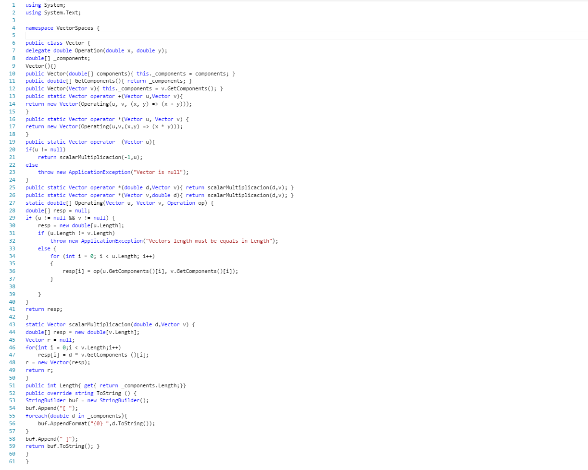
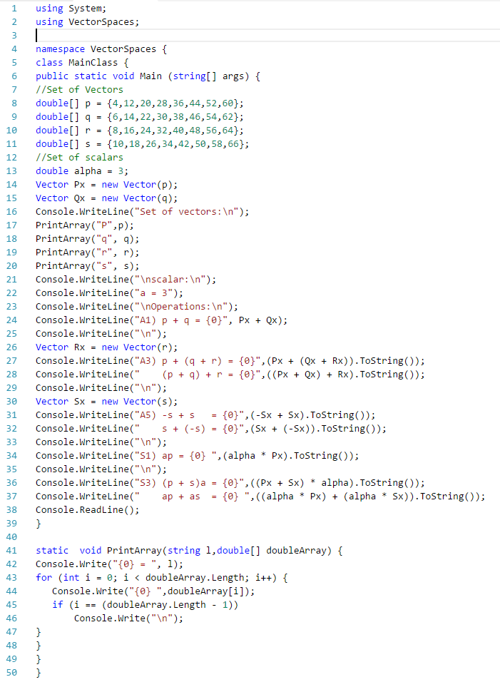
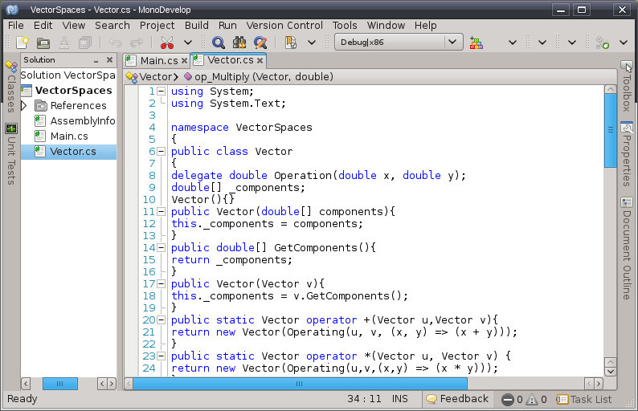
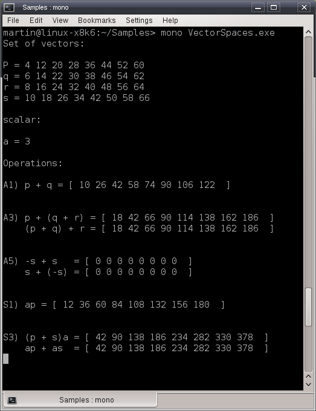

# Sobrecarga de operadores en C# utilizando vectores

Además de los operadores para los tipos primitivos, C# tiene una característica conocida como sobrecarga de operadores la cuál permite que los operadores para tipos primitivos puedan utilizarse con objetos, permitiéndonos definir el tipo de operación, como se va a efectuar, los tipos involucrados y valor que devuelve, un ejemplo típico de esta funcionalidad lo tenemos en la concatenación de objetos <b>String</b> en donde se utiliza el símbolo "+" para la concatenación de cadenas que igualmente es utilizado para la adicción de enteros, como se muestra en los siguientes ejemplos:

 Adicción de enteros 
-------------------- 
int a = 18; 
int b = 66; 
Console.Write(a + b); //imprime 84   
Concatenación de cadenas 
-------------------------  
String s1 = "Once upon "; 
String s2 = "a hero "; 
Console.Write(s1 + s2); //imprime Once upon a hero 

Para ejemplificar como funciona la sobrecarga de operadores en objetos utilizaremos las operaciones con vectores que se estudian en el álgebra lineal, por lo que antes de codificar daremos algunas definiciones.

<i>Un vector es un objeto perteneciente a un espacio vectorial, que para los casos particulares de espacios R2 y R3 podemos representarlos gráficamente como segmentos de línea dirigidos con un punto inicial y un punto final describiendo la asociación de una magnitud y una dirección.</i>  Un espacio vectorial consiste de: 
<ol>
<li>Un campo F de escalares (en general los número reales).</li>
<li>Un conjunto V de elementos llamados vectores.</li>
<li>Un conjunto de reglas (u operaciones) llamadas suma y multiplicación que según los textos especialistas en la materia se dividen en dos categorías, una para la adicción y otra para la multiplicación.</li>
</ol>
 <b>Los axiomas para la adición espacios vectoriales son:</b> 
<ul>
<li>A1. Si <i>u</i> y <i>v</i> están en <i>V</i>, entonces <i>u + v</i> está dentro de V</li>
<li>A2. <i>u + v = v + u</i> para todos <i>u</i> y <i>v</i> que estan en <i>V</i></li>
<li>A3. <i>u + (v + w) = (u + v) + w</i> para todos los <i>u,v</i> y <i>w</i> en <i>V</i></li>
<li>A4. Un elemento 0 en <i>V</i> existe tal que <i>v + 0 = v</i> para cada <i>v</i> en <i>V</i>.</li>
<li>A5. Para cada <i>v</i> en <i>V</i>, existe un elemento <i>-v</i> en <i>V</i> tal que <i>-v + v = 0 y v + (-v) = 0</i></li>
</ul>  <b>Los axiomas para la multiplicación son:</b> 
<ul>
<li>S1. Si v esta en V entonces av esta en V para cada a en R.</li>
<li>S2. a(v + w) = av + aw para cada v y w en V y para cada a en R.</li>
<li>S3. (a+b)v = av + bv para cada v en V y para cada a y b en R.</li>
<li>S4. a(bv) = (ab)v para cada v en V y para todos cada a y b en R.</li>
<li>S5. 1v = v para cada v en V.</li>
</ul> 

Ahora con estos conceptos pasemos al código, primeramente crearemos nuestra clase <b>Vector</b> en donde utilizando la palabra reservada <tt>operator</tt> definiremos las operaciones para demostrar algunos de los axiomas expuestos. A continuación el listado de dicha clase. 

 
<!--Code -->

    
    
 
<!--Code-->

Como vemos en este código utilizamos la sobrecarga de operadores utilizando la palabra clave <tt>operator</tt> en los siguientes métodos: 
<pre>
 public static Vector operator +(Vector u,Vector v) 
public static Vector operator *(Vector u, Vector v) 
public static Vector operator -(Vector u) public static Vector operator *(double d,Vector v) 
public static Vector operator *(Vector v,double d) 
</pre>
 Aquí definimos la operación, el número de parámetros con los que se llevará a cabo y por supuesto su implementación. Ahora con el siguiente listado mostraremos la utilización de clase <b>Vector</b> y el uso de la sobrecarga de operadores para vectores de números reales: 
<!--Code-->

    
    
 
<!--Code -->
 Si agregamos estas clases a un proyecto de consola en MonoDevelop podemos tener una solución lista para corregir y compilar. 

    

 
 Al ejecutar la solución, veremos el resultado como en la siguiente imagen: 

    
 
 
